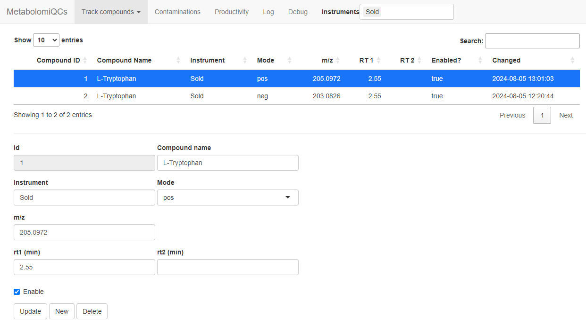

## Download and compilation

Make sure to revisit the prerequisites on the front page.

First download the repository to somewhere convenient (here `/opt`).

``` bash
cd /opt
sudo git lfs clone https://github.com/stanstrup/QC4Metabolomics.git
cd QC4Metabolomics
sudo chmod +x ./setup/*.sh
```

Now you need to build the image which require downloading many R packages (a pre-compiled image is not currently available) and will take a while. This will also start the demo.

``` bash
docker compose --file docker-compose_demo.yml up --build
```

\

## Using the demo

You can now open the demo in your browser by visiting `localhost`. It might take a few minutes before it can load though since the database needs to be initialized on first load.

You will also see that no plots appear. This is because no compounds to look for has been defined.

First click the `Contaminants` tab. If no plot appears go get a coffee and come back and reload the page (it will look for new compounds every 1 min and then analyze the data). The plot is available when the system has analyzed the demo files. Once a plot appears you can try to change the "Minimum intensity in any sample" for example to 10^3^). Now you can see which are the most common contaminants.

Now we want to make the tracking of specific analytes work. So go to the `Track compounds` --\> `Compound settings` tab. Now we fill in the data to track Tryptophan in both modes.\
These are the settings you need:

| Compound name | Instrument | Mode | m/z      | RT1  |
|---------------|------------|------|----------|------|
| L-Tryptophan  | Sold       | pos  | 205.0972 | 2.55 |
| L-Tryptophan  | Sold       | neg  | 203.0826 | 2.55 |

\

```{r pressure, echo=FALSE, fig.cap="Settings to track tryptophan", out.width = '100%', fig.align='center'}

```

\
Click "Submit" when you have filled the form and repeat for the second compound/mode.

When you are done it should look like this:


After some minutes you should be able reload the browser and see the data for tryptophan in the demo data.
