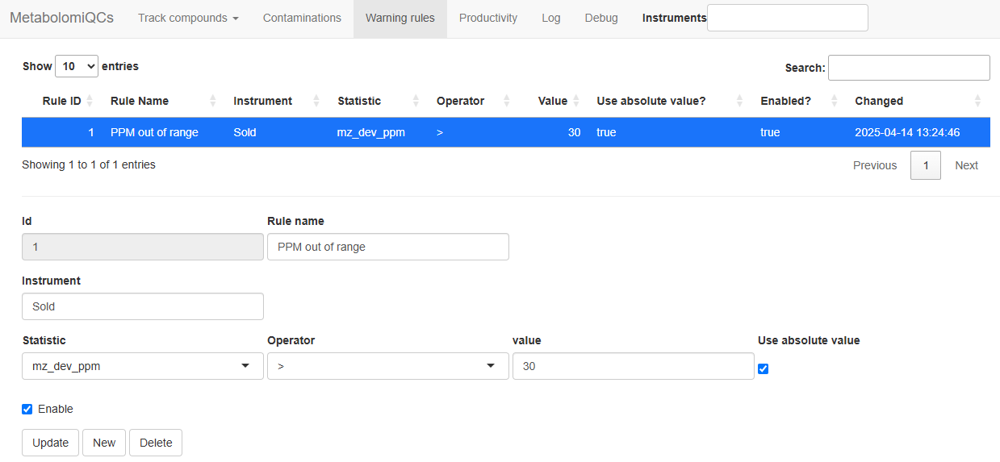

## Download and compilation

Make sure to revisit the prerequisites on the front page.

First download the repository to somewhere convenient (here `/opt`).

``` bash
cd /opt
sudo git lfs clone https://github.com/stanstrup/QC4Metabolomics.git
cd QC4Metabolomics
sudo chmod +x ./setup/*.sh
```

Now you need to build the image which require downloading many R packages (a pre-compiled image is not currently available) and will take a while. This will also start the demo.

``` bash
docker compose --file docker-compose_demo.yml up --build --force-recreate
```

\

## Getting started with the demo

You can now open the demo in your browser by visiting `localhost`. It might take a few minutes before it can load though since the database needs to be initialized on first load.

You will also see that no plots appear. This is because no compounds to look for has been defined.

First click the `Contaminants` tab. If no plot appears go get a coffee and come back and reload the page (it will look for new compounds every 1 min and then analyze the data). The plot is available when the system has analyzed the demo files. Once a plot appears you can try to change the "Minimum intensity in any sample" for example to 10^3^). Now you can see which are the most common contaminants.

## Track specific compounds

Now we want to make the tracking of specific analytes work. So go to the `Track compounds` --\> `Compound settings` tab. Now we fill in the data to track Tryptophan in both modes.\
These are the settings you need:

| Compound name | Instrument | Mode | m/z      | RT1  |
|---------------|------------|------|----------|------|
| L-Tryptophan  | Sold       | pos  | 188.0706 | 2.55 |
| L-Tryptophan  | Sold       | neg  | 203.0826 | 2.55 |

\

Click "Submit" when you have filled the form and repeat for the second compound/mode.

When you are done it should look like this:

```{r track-trp, echo=FALSE, fig.cap="Settings to track tryptophan", out.width = '100%', fig.align='center'}
knitr::include_graphics("trp_settings.png")
```

After some minutes you should be able reload the browser and see the data for tryptophan in the "Track compounds" -\> "Compound stats" tab.

## Enabling email warnings

By default the e-mail warnings are off, since you need to supply your own email server settings to send e-mails.\
You can use gmail or any other SMTP server to send emails. To use gmail you need to create an "app password", which can be done in your gmail [account](https://myaccount.google.com/apppasswords).\
\
Once you have create your password you need to edit the settings for the "Warner module". You do that by opening the file `settings_demo.env` and scrolling down to the section "module: Warner". First you enable the module by setting `QC4METABOLOMICS_module_Warner_enabled`.

``` ini
QC4METABOLOMICS_module_Warner_enabled=TRUE
```

Next you need to set your credentials and server. Below is an example where `EMAIL_SENDER` and `YOUR_USER` would be your email address for the account that sends the emails and `EMAIL_RECEIVER` would be the address of the email that should receive the emails (can be the same as the sender). The password is the account password or in the case of gmail the "app password". Below are the settings needed for gmail.

``` ini
QC4METABOLOMICS_module_Warner_email_from=EMAIL_SENDER
QC4METABOLOMICS_module_Warner_email_to=EMAIL_RECEIVER
QC4METABOLOMICS_module_Warner_email_user=YOUR_USER
QC4METABOLOMICS_module_Warner_email_password=YOUR_PASSWORD
QC4METABOLOMICS_module_Warner_email_host=smtp.gmail.com
QC4METABOLOMICS_module_Warner_email_port=587
QC4METABOLOMICS_module_Warner_email_use_ssl=TRUE
```

You should now stop QC4Metabolomics (`ctrl + C`) and start it again using:

``` bash
docker compose --file docker-compose_demo.yml up --build --force-recreate
```

\

Next go to the "Warning rules" tab and setup some rules. Any file that matches any of the rules will trigger an email. The emails are send as soon as a matching file is found, but in bulk for all newly found files and only once per file.\

The rule only apply to files from a specific `Instrument`, as extracted from the filename. Next you need to select which statistic to monitor. Usually the most relevant statistics are the *m/z* deviation from the expected (`mz_dev_ppm`), the retention time deviation from the expected in minutes (`rt_dev`) and the apex intensity (`maxo`).\
You then choose the `operator` meaning the comparison to be done. "Greater than" (`>`) would be typical. Then the `Value` to compare the statistic to needs to be chosen and finally it should be decided if the absolute value of the `Value` is to be considered instead of the raw value.

\
To check the system with the demo you could try these settings that will trigger on all files where the *m/z* deviation is more than 30 ppm.

| Rule Name        | Instrument | Statistics | Operator | Value | Use absolute value? |
|---------------|-----------|------------|---------|-------|-------------------|
| PPM out of range | Sold       | mz_dev_ppm | \>       | 30    | TRUE                |

\

```{r warn-email, echo=FALSE, fig.cap="Settings to trigger warnings", out.width = '100%', fig.align='center'}

```
